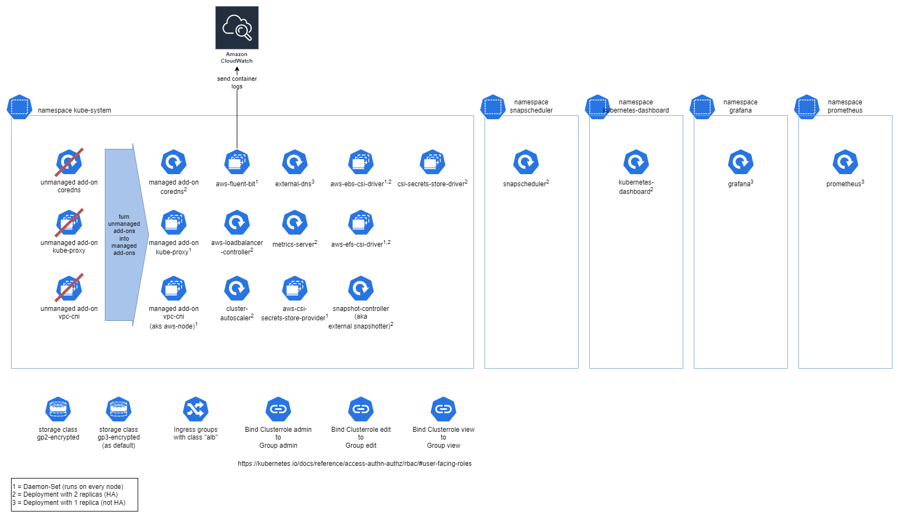
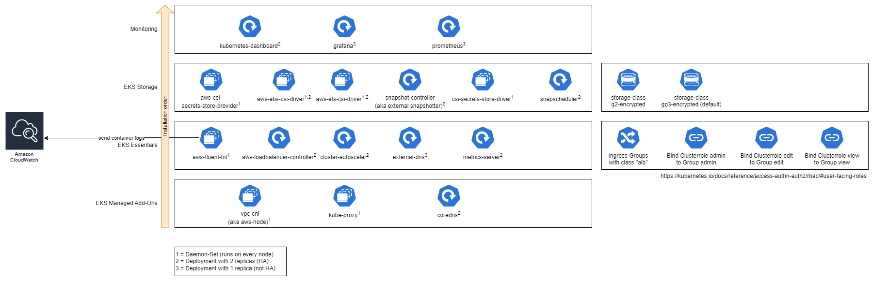

# Bootstrapping an AWS EKS Cluster

## Prerequisites

- AWS EKS Cluster >= 1.22
  - 2 nodes in 2 different availability zones recommended
  - Nodes should by tagged accordingly for Cluster Autoscaler to work
  - IRSA must be enabled
  - You will need the kubeconfig file used by `kubectl` for your cluster. You can retrieve the file into the current directory by executing `aws eks update-kubeconfig --name CLUSTER_NAME --kubeconfig ./kubeconfig.yaml`. See [AWS CLI](https://awscli.amazonaws.com/v2/documentation/api/latest/reference/eks/update-kubeconfig.html).

## Overview

### Components by namespace



### Components by installation order



### Component details

|Name|Versions|Description|Details|
|----|--------|-----------|-------|
|[core-dns](https://docs.aws.amazon.com/eks/latest/userguide/managing-coredns.html)<br/>AWS managed|**App:** `v1.8.7-eksbuild.3` (auto update to latest version on tf apply)|CoreDNS is a flexible, extensible DNS server that can serve as the Kubernetes cluster DNS. Converts the preinstalled self managed add-on into a managed addon.|**Code:** [terraform](./modules/bundle-eks-managed-addons/modules/coredns/coredns.tf)|
|[kube-proxy](https://docs.aws.amazon.com/eks/latest/userguide/managing-kube-proxy.html)<br/>AWS managed|**App:** `v1.23.8-eksbuild.2` (auto update to latest version on tf apply)|Kube-proxy maintains network rules on each Amazon EC2 node. It enables network communication to your pods. Converts the preinstalled self managed add-on into a managed addon.|**Code:** [terraform](./modules/bundle-eks-managed-addons/modules/kube-proxy/kube_proxy.tf)|
|[vpc-cni](https://docs.aws.amazon.com/eks/latest/userguide/managing-vpc-cni.html)<br/>AWS managed|**App:** `v1.12.0-eksbuild.1` (auto update to latest version on tf apply)|Amazon EKS supports native VPC networking with the Amazon VPC Container Network Interface (CNI) plugin for Kubernetes. This plugin allows Kubernetes pods to have the same IP address inside the pod as they do on the VPC network. Converts the preinstalled self managed add-on into a managed addon.|**Code:** [terraform](./modules/bundle-eks-managed-addons/modules/vpc-cni/vpc_cni.tf)<br/>**IAM Role:** `{cluster_name}-aws-node`|
|[AWS for Fluent Bit](https://docs.fluentbit.io/manual/pipeline/outputs/cloudwatch)|**App:** [`2.28.1`](https://github.com/aws/aws-for-fluent-bit/releases/tag/v2.28.1) (2022-Sep-13)<br/>**Helm:** [`0.1.21`](https://github.com/aws/eks-charts/releases/tag/v0.0.105) (2022-Sep-08)|Forwarding of Container Logs to AWS Cloudwatch. Other AWS Log sinks can be configured additionally.|**Code:** [terraform](./modules/bundle-eks-essentials/modules/aws-fluent-bit/aws_fluent_bit.tf)<br/>**Helm Source:** [github.com/aws/eks-charts](https://github.com/aws/eks-charts/tree/v0.0.105/stable/aws-for-fluent-bit)<br/>**Helm Repo:** [aws.github.io/eks-charts](https://aws.github.io/eks-charts/index.yaml)<br/>**Helm Chart:** `aws-for-fluent-bit`<br/>**IAM Role:** `{cluster_name}-fluent-bit`|
|[AWS LoadBalancer Controller](https://kubernetes-sigs.github.io/aws-load-balancer-controller/v2.4/)|**App:** [`2.4.4`](https://github.com/kubernetes-sigs/aws-load-balancer-controller/releases/tag/v2.4.4) (2022-Sep-24)<br/>**Helm:** [`1.4.5`](https://github.com/aws/eks-charts/releases/tag/v0.0.108) (2022-Sep-24)|The AWS Load Balancer Controller manages AWS Elastic Load Balancers for a Kubernetes cluster. This also deploys default settings for the LB group `bootstrapping` like HTTP redirects to HTTPS and Logging|**Code:** [terraform](./modules/bundle-eks-essentials/modules/aws-loadbalancer-controller/aws_loadbalancer_controller.tf)<br/>**Helm Source:** [github.com/aws/eks-charts](https://github.com/aws/eks-charts/blob/v0.0.108/stable/aws-load-balancer-controller/Chart.yaml)<br/>**Helm Repo:** [aws.github.io/eks-charts](https://aws.github.io/eks-charts/index.yaml)<br/>**Helm Chart:** `aws-load-balancer-controller`<br/>**IAM Role:** `{cluster_name}-aws-load-balancer-controller`|
|[Cluster Autoscaler](https://docs.aws.amazon.com/eks/latest/userguide/autoscaling.html#cluster-autoscaler)|**App:** [`v1.25.0`](https://github.com/kubernetes/autoscaler/releases/tag/cluster-autoscaler-1.25.0) (2022-Sep-06)<br/>**Helm:** [`9.21.0`](https://github.com/kubernetes/autoscaler/releases/tag/cluster-autoscaler-chart-9.21.0) (2022-Sep-05)|The Kubernetes Cluster Autoscaler automatically adjusts the number of nodes in your cluster when pods fail or are rescheduled onto other nodes.|**Code:** [terraform](./modules/bundle-eks-essentials/modules/cluster-autoscaler/cluster_autoscaler.tf)<br/>**Helm Source:** [github.com/kubernetes/autoscaler](https://github.com/kubernetes/autoscaler/tree/cluster-autoscaler-chart-9.21.0/charts/cluster-autoscaler)<br/>**Helm Repo:** [kubernetes.github.io/autoscaler](https://kubernetes.github.io/autoscaler/index.yaml)<br/>**Helm Chart:** `cluster-autoscaler`<br/>**IAM Role:** `{cluster_name}-cluster-autoscaler`|
|[External DNS](https://github.com/kubernetes-sigs/external-dns/blob/master/docs/tutorials/aws.md)|**App:** [`v0.12.2`](https://github.com/kubernetes-sigs/external-dns/releases/tag/v0.12.2)<br/>(2022-Jul-27)<br/>**Helm:** [`6.5.6`](https://github.com/bitnami/charts/commit/94738321119299adb2777fe48ebf92ca51fb2dfd) (2022-Jun-14)|ExternalDNS synchronizes exposed Kubernetes Services and Ingresses with DNS providers.|**Code:** [terraform](./modules/bundle-eks-essentials/modules/external-dns/external_dns.tf)<br/>**Helm Source:** [github.com/bitnami/charts](https://github.com/bitnami/charts/tree/master/bitnami/external-dns)<br/>**Helm Repo:** [charts.bitnami.com/bitnami](https://charts.bitnami.com/bitnami/index.yaml)<br/>**Helm Chart:** `external-dns`<br/>**IAM Role:** `{cluster_name}-external-dns`|
|[Metrics Server](https://github.com/kubernetes-sigs/metrics-server)|**App:** [`v0.6.1`](https://github.com/kubernetes-sigs/metrics-server/releases/tag/v0.6.1) (2022-Feb-09)<br/>**Helm:** [`3.8.2`](https://github.com/kubernetes-sigs/metrics-server/releases/tag/metrics-server-helm-chart-3.8.2) (2022-Feb-23)|The Kubernetes Metrics Server is an aggregator of resource usage data in your cluster. The Metrics Server is commonly used by other Kubernetes add ons, such as the Horizontal Pod Autoscaler or the Kubernetes Dashboard.|**Code:** [terraform](./modules/bundle-eks-essentials/modules/metrics-server/metrics_server.tf)<br/>**Helm Source:** [github.com/kubernetes-sigs/metrics-server](https://github.com/kubernetes-sigs/metrics-server/tree/metrics-server-helm-chart-3.8.2/charts/metrics-server)<br/>**Helm Repo:** [kubernetes-sigs.github.io/metrics-server](https://kubernetes-sigs.github.io/metrics-server/index.yaml)<br/>**Helm Chart:** `metrics-server`|
|[Calico<br/>**(OPTIONAL)**](https://docs.aws.amazon.com/eks/latest/userguide/calico.html)|**App:** [Tigera-Operator `v1.28.1`](https://github.com/tigera/operator/releases/tag/v1.28.1) (2022-Aug-26)<br/>**App:** [Calico `v3.24.1`](https://github.com/projectcalico/calico/releases/tag/v3.24.1) (2022-Aug-26)<br/>**Helm:** [`3.24.1`](https://github.com/projectcalico/calico/releases/tag/v3.24.1) (2022-Aug-26)|Project Calico is a network policy engine for Kubernetes. With Calico network policy enforcement, you can implement network segmentation and tenant isolation.|**Code:** [terraform](./modules/bundle-eks-essentials/modules/calico-tigera-operator/calico_tigera_operator.tf)<br/>**Helm Source:** [github.com/projectcalico/calico](https://github.com/projectcalico/calico/tree/v3.24.1/charts/tigera-operator)<br/>**Helm Repo:** [projectcalico.docs.tigera.io/charts](https://projectcalico.docs.tigera.io/charts/index.yaml)<br/>**Helm Chart:** `tigera-operator`|
|[AWS CSI Secrets Store Provider](https://docs.aws.amazon.com/secretsmanager/latest/userguide/integrating_csi_driver.html)|**App:** [`1.0.r2-6-gee95299-2022.04.14.21.07`](https://gallery.ecr.aws/aws-secrets-manager/secrets-store-csi-driver-provider-aws)<br/>**Helm:** [`0.0.3`](https://github.com/aws/eks-charts/releases/tag/v0.0.95) (2022-Jun-03)|To show secrets from Secrets Manager as files mounted in Amazon EKS pods, you can use this AWS Secrets and Configuration Provider|**Code:** [terraform](./modules/bundle-eks-storage/modules/aws-csi-secrets-store-provider/aws_csi_secrets_store_provider.tf)<br/>**Helm Source:** [github.com/aws/eks-charts](https://github.com/aws/eks-charts/tree/v0.0.95/stable/csi-secrets-store-provider-aws)<br/>**Helm Repo:** [aws.github.io/eks-charts](https://aws.github.io/eks-charts/index.yaml)<br/>**Helm Chart:** `csi-secrets-store-provider-aws`|
|[AWS EBS CSI Driver](https://github.com/kubernetes-sigs/aws-ebs-csi-driver)|**App:** [`1.11.3`](https://github.com/kubernetes-sigs/aws-ebs-csi-driver/releases/tag/v1.11.3) (2022-Sep-16)<br/>**Helm:** [`2.11.1`](https://github.com/kubernetes-sigs/aws-ebs-csi-driver/releases/tag/helm-chart-aws-ebs-csi-driver-2.11.1) (2022-Sep-16)|The Amazon Elastic Block Store Container Storage Interface (CSI) Driver provides a CSI interface used by Container Orchestrators to manage the lifecycle of Amazon EBS volumes. Required for using gp3 and using EBS snapshots.|**Code:** [terraform](./modules/bundle-eks-storage/modules/aws-ebs-csi-driver/aws_ebs_csi_driver.tf)<br/>**Helm Source:** [github.com/kubernetes-sigs/aws-ebs-csi-driver](https://github.com/kubernetes-sigs/aws-ebs-csi-driver/tree/6522c556f8a2b959cf11e3bb015f71c73cf8a3e6)<br/>**Helm Repo:** [kubernetes-sigs.github.io/aws-ebs-csi-driver](https://kubernetes-sigs.github.io/aws-ebs-csi-driver/index.yaml)<br/>**Helm Chart:** `aws-ebs-csi-driver`<br/>**IAM Role:** `{cluster_name}-ebs-csi-controller`|
|[AWS EFS CSI Driver](https://github.com/kubernetes-sigs/aws-efs-csi-driver/)|**App:** [`1.4.5`](https://github.com/kubernetes-sigs/aws-efs-csi-driver/releases/tag/v1.4.5) (2022-Nov-10)<br/>**Helm:** [`2.3.2`](https://github.com/kubernetes-sigs/aws-efs-csi-driver/tree/helm-chart-aws-efs-csi-driver-2.3.2) (2022-Nov-10)|The Amazon Elastic File System Container Storage Interface (CSI) Driver implements the CSI specification for container orchestrators to manage the lifecycle of Amazon EFS file systems.|**Code:** [terraform](./modules/bundle-eks-storage/modules/aws-efs-csi-driver/aws_efs_csi_driver.tf)<br/>**Helm Source:** [github.com/kubernetes-sigs/aws-efs-csi-driver](https://github.com/kubernetes-sigs/aws-efs-csi-driver/tree/master/charts/aws-efs-csi-driver)<br/>**Helm Repo:** [kubernetes-sigs.github.io/aws-efs-csi-driver](https://kubernetes-sigs.github.io/aws-efs-csi-driver/index.yaml)<br/>**Helm Chart:** `aws-efs-csi-driver`<br/>**IAM Role:** `{cluster_name}-efs-csi-controller`|
|[Snapshot-Controller<br/>aka CSI External Snapshotter](https://github.com/kubernetes-csi/external-snapshotter/releases/tag/v6.0.1)|**App:** [`v6.1.0`](https://github.com/kubernetes-csi/external-snapshotter/releases/tag/v6.1.0) (2022-Sep-27)<br/>**Helm:** [`0.1.1`](./modules/bundle-eks-storage/modules/csi-external-snapshotter/files/charts/csi-external-snapshotter/) (2022-Sep-27)|The CSI snapshotter is part of Kubernetes implementation of Container Storage Interface (CSI). The volume snapshot feature supports CSI v1.0 and higher. Required for creating snapshots.|**Code:** [terraform](./modules/bundle-eks-storage/modules/csi-external-snapshotter/csi_external_snapshotter.tf)<br/>**Helm Source:** [charts/csi-external-snapshotter](./charts/csi-external-snapshotter/)|
|[CSI Secrets Store Driver](https://docs.aws.amazon.com/secretsmanager/latest/userguide/integrating_csi_driver.html)|**App:** [`v1.2.4`](https://github.com/kubernetes-sigs/secrets-store-csi-driver/releases/tag/v1.2.4) (2022-Sep-08)<br/>**Helm:** [`1.2.4`](https://github.com/kubernetes-sigs/secrets-store-csi-driver/releases/tag/v1.2.4) (2022-Sep-08)|Prerequisite for 'CSI Secrets Store Provider AWS'|**Code:** [terraform](./modules/bundle-eks-storage/modules/csi-secrets-store-driver/csi_secrets_store_driver.tf)<br/>**Helm Source:** [github.com/kubernetes-sigs/secrets-store-csi-driver](https://github.com/kubernetes-sigs/secrets-store-csi-driver/tree/v1.2.4/charts/secrets-store-csi-driver)<br/>**Helm Repo:** [kubernetes-sigs.github.io/secrets-store-csi-driver/charts](https://kubernetes-sigs.github.io/secrets-store-csi-driver/charts/index.yaml)<br/>**Helm Chart:** `secrets-store-csi-driver`|
|[Snapscheduler](https://backube.github.io/snapscheduler/install.html)|**App:** [`3.1.0`](https://github.com/backube/snapscheduler/releases/tag/v3.1.0) (2022-Aug-01)<br/>**Helm:** [`3.1.0`](https://github.com/backube/snapscheduler/releases/tag/v3.1.0) (2022-Aug-01)|Snapscheduler enables taking snapshots of Kubernetes Persistent Volumes according to a defined schedule|**Code:** [terraform](./modules/bundle-eks-storage/modules/snapscheduler/snapscheduler.tf)<br/>**Helm Source:** [github.com/backube/snapscheduler](https://github.com/backube/snapscheduler/tree/v3.1.0/helm/snapscheduler)<br/>**Helm Repo:** [backube.github.io/helm-charts](https://backube.github.io/helm-charts/index.yaml)<br/>**Helm Chart:** `snapscheduler`|
|[Kubernetes Dashboard](https://github.com/kubernetes/dashboard)|**App:** [`v2.7.0`](https://github.com/kubernetes/dashboard/releases/tag/v2.7.0) (2022-Sep-16)<br/>**Helm:** [`5.10.0`](https://github.com/kubernetes/dashboard/pull/7370) (2022-Aug-24)|Kubernetes Dashboard is a general purpose, web-based UI for Kubernetes clusters. Deployed with readonly permissions and exposed via ingress. TODO: Write doc|**Code:** [terraform](./modules/bundle_monitoring/modules/kubernetes-dashboard/kubernetes_dashboard.tf)<br/>**Helm Source:** [github.com/kubernetes/dashboard](https://github.com/kubernetes/dashboard/commit/5d1383efa2e5f9402bd95ec0922f0aa0f810fa77)<br/>**Helm Repo:** [kubernetes.github.io/dashboard](https://kubernetes.github.io/dashboard/index.yaml)<br/>**Helm Chart:** `kubernetes-dashboard`|
|[Grafana](https://grafana.com/oss/grafana/)|**App:** [`8.5.15`](https://github.com/grafana/grafana/releases/tag/v8.5.15) (2022-Nov-08)<br/>**Helm:** [`6.25.1`](https://github.com/grafana/helm-charts/releases/tag/grafana-6.25.1) (2022-Apr-04)|Grafana allows you to query, visualize, alert on and understand your metrics no matter where they are stored. Create, explore, and share beautiful dashboards with your team and foster a data driven culture. Grafana is accessible via SSO from the Internet.|**Code:** [terraform](./modules/bundle_monitoring/modules/grafana/grafana.tf)<br/>**Helm Source:** [github.com/grafana/helm-charts](https://github.com/grafana/helm-charts/tree/grafana-6.25.1/charts/grafana)<br/>**Helm Repo:** [grafana.github.io/helm-charts](https://grafana.github.io/helm-charts/index.yaml)<br/>**Helm Chart:** `grafana`<br/>**IAM Role:** `{cluster_name}-grafana`|
|[Prometheus](https://prometheus.io/)|**App:** [`v2.38.0`](https://github.com/prometheus/prometheus/releases/tag/v2.38.0) (2022-Aug-16)<br/>**Helm:** [`15.13.0`](https://github.com/prometheus-community/helm-charts/releases/tag/prometheus-15.13.0) (2022-Sep-20)|Prometheus is an open-source systems monitoring and alerting toolkit.|**Code:** [terraform](./modules/bundle_monitoring/modules/prometheus/prometheus.tf)<br/>**Helm Source:** [github.com/prometheus-community/helm-charts](https://github.com/prometheus-community/helm-charts/tree/prometheus-15.13.0/charts/prometheus)<br/>**Helm Repo:** [prometheus-community.github.io/helm-charts](https://prometheus-community.github.io/helm-charts/index.yaml)<br/>**Helm Chart:** `prometheus`|

New image registry for Kubernetes projects since Mid of 2022 is `registry.k8s.io` - See [here](https://github.com/kubernetes/k8s.io/wiki/New-Registry-url-for-Kubernetes-(registry.k8s.io)) for details.

## Usage

**Please see [examples folder](./examples/) for complete sample use-cases!**

## 0. Usage prerequisites

1. Terraform installed
2. AWS CLI v2 installed
3. AWS credentials set accordingly to have the following permissions at the EKS cluster:

    - `system:masters` permission in EKS cluster
    - `Admin` permissions in your AWS account

### 1. Terraform Providers

You will always need to configure the providers used by Terraform accordingly.
Create a file `providers.tf` and fill with this content - You can change the tags set to all AWS resources.

```hcl
provider "aws" {
  region = var.region
  default_tags {
    tags = {
      "CreatedBy"          = "PharmaLedger Association"
      "ManagedBy"          = "Terraform"
      "Project"            = "PharmaLedger"
      "TechnicalContact_1" = "firstname1.lastname1@pharmaledger.org"
      "TechnicalContact_2" = "firstname2.lastname2@pharmaledger.org"
    }
  }
}

data "aws_eks_cluster" "cluster" {
  name = var.eks_cluster_name
}
provider "kubernetes" {
  host                   = element(concat(data.aws_eks_cluster.cluster[*].endpoint, [""]), 0)
  cluster_ca_certificate = base64decode(element(concat(data.aws_eks_cluster.cluster[*].certificate_authority[0].data, [""]), 0))
  # Important: We cannot use the token. It seems that the token is being retrieved at terraform plan phase.
  # At plan phase we use a principal with readonly permissions. 
  # This means, any changes at apply phase will be tried with readonly permissions and will fail.
  # Therefore we retrieve a fresh token via aws eks command
  #  token                  = element(concat(data.aws_eks_cluster_auth.cluster[*].token, [""]), 0)
  exec {
    api_version = "client.authentication.k8s.io/v1beta1"
    args        = ["eks", "get-token", "--cluster-name", var.eks_cluster_name, "--region", var.region]
    command     = "aws"
  }
}
provider "helm" {
  kubernetes {
    host                   = element(concat(data.aws_eks_cluster.cluster[*].endpoint, [""]), 0)
    cluster_ca_certificate = base64decode(element(concat(data.aws_eks_cluster.cluster[*].certificate_authority[0].data, [""]), 0))
    # Important: We cannot use the token. It seems that the token is being retrieved at terraform plan phase.
    # At plan phase we use a principal with readonly permissions. 
    # This means, any changes at apply phase will be tried with readonly permissions and will fail.
    # Therefore we retrieve a fresh token via aws eks command
    #  token                  = element(concat(data.aws_eks_cluster_auth.cluster[*].token, [""]), 0)
    exec {
      api_version = "client.authentication.k8s.io/v1beta1"
      args        = ["eks", "get-token", "--cluster-name", var.eks_cluster_name, "--region", var.region]
      command     = "aws"
    }
  }
}
```

### 2. Prepare Variables

You should not hard-code any variable values (e.g. stage/environment dependent values) into you terraform files.
First, declare all variables (not the variable values!) in a file named `variables.tf`.

```hcl
variable "account_id" {
  type        = string
  description = "The 12 digit account id, e.g. 012345678901."
}
variable "region" {
  type        = string
  description = "The AWS region, defaults to eu-central-1"
  default     = "eu-central-1"
}
variable "eks_cluster_name" {
  description = "Name/ID of the EKS Cluster"
  type        = string
}
variable "kubeconfig_filename" {
  description = "The filename of an existing kubeconfig file."
  type        = string
}
```

Then create a `.tfvars` file for each stage/environment (here: `dev` and `prod`),

`terraform-dev.tfvars`:

```hcl
account_id          = "123456789012"
eks_cluster_name    = "my-dev-cluster"
kubeconfig_filename = "kubeconfig-dev.yaml"
```

and `terraform-prod.tfvars`:

```hcl
account_id          = "987654321098"
eks_cluster_name    = "my-prod-cluster"
kubeconfig_filename = "kubeconfig-prod.yaml"
```

### 3. Minimal Bootstrapping

This is a minimal sample for bootstrapping your cluster.
It will set up all components but will not expose Grafana or Kubernetes-Dashboard to the internet.

Create file `main.tf`

```hcl
module "bootstrapping" {

  # IMPORTANT: The source can be either
  # a) a copy of this repository into your own repo (local copy), e.g. to `modules/aws-eks-bootstrapping` - `source = "./modules/aws-eks-bootstrapping"`
  # b) a copy of this repository into a dedicated repo of your choice. See https://developer.hashicorp.com/terraform/language/modules/sources for configuring the module source.

  source = "./modules/aws-eks-bootstrapping" # Here we assume, it is a local copy

  region              = var.region
  eks_cluster_name    = var.eks_cluster_name
  account_id          = var.account_id
  kubeconfig_filename = var.kubeconfig_filename
}
```

Get the kubeconfig files for dev and prod environments by executing the AWS CLI:

```shell
aws eks update-kubeconfig --name my-dev-cluster --kubeconfig ./kubeconfig-dev.yaml
aws eks update-kubeconfig --name my-prod-cluster --kubeconfig ./kubeconfig-prod.yaml
```

Init terraform

```shell
terraform init
```

and install for `dev` environment:

```shell
terraform plan -var-file=terraform-dev.tfvars -state=terraform-dev.tfstate -out=plan-dev.tfplan
terraform apply -input=false -state=terraform-dev.tfstate plan-dev.tfplan
```

and/or for `prod`:

```shell
terraform plan -var-file=terraform-prod.tfvars -state=terraform-prod.tfstate -out=plan-prod.tfplan
terraform apply -input=false -state=terraform-prod.tfstate plan-prod.tfplan
```

**NOTE: Always store your terraform state safely and do not loose it!**
Instead of storing the state locally use the [terraform S3 backend](https://developer.hashicorp.com/terraform/language/settings/backends/s3).

## Prerequisites for adding changes to the repository

- [pre-commit for terraform](https://github.com/antonbabenko/pre-commit-terraform#1-install-dependencies) with these additional tools (see file `.pre-commit-config.yaml`)
  - terraform-docs
  - TFLint

## Contributing

See [here](CONTRIBUTING.md)

## Doc generation

Code formatting and documentation for variables and outputs is generated using [pre-commit-terraform hooks](https://github.com/antonbabenko/pre-commit-terraform) which uses [terraform-docs](https://github.com/segmentio/terraform-docs).
Follow [these instructions](https://github.com/antonbabenko/pre-commit-terraform#how-to-install) to install pre-commit locally and install `terraform-docs` either via download from [github.com](https://github.com/terraform-docs/terraform-docs/releases) or via package managers `go get github.com/segmentio/terraform-docs` or `brew install terraform-docs`.

1. Pay attention that a `README.md` file **must be utf-8 encoded**!
2. Does not work on Windows, use Linux or Mac instead!

## Authors

Created by

- [tgip-work](https://github.com/tgip-work)

## Terraform Module Details

<!-- BEGINNING OF PRE-COMMIT-TERRAFORM DOCS HOOK -->
### Requirements

| Name | Version |
|------|---------|
| <a name="requirement_terraform"></a> [terraform](#requirement\_terraform) | >= 1.0 |
| <a name="requirement_aws"></a> [aws](#requirement\_aws) | >= 4.0, < 5.0 |
| <a name="requirement_helm"></a> [helm](#requirement\_helm) | >= 2.7.1 |
| <a name="requirement_kubernetes"></a> [kubernetes](#requirement\_kubernetes) | >= 2.10 |
| <a name="requirement_local"></a> [local](#requirement\_local) | >= 2.2.3 |
| <a name="requirement_null"></a> [null](#requirement\_null) | >= 2.1.0, < 4.0.0 |

### Providers

| Name | Version |
|------|---------|
| <a name="provider_aws"></a> [aws](#provider\_aws) | >= 4.0, < 5.0 |

### Modules

| Name | Source | Version |
|------|--------|---------|
| <a name="module_bundle_eks_essentials"></a> [bundle\_eks\_essentials](#module\_bundle\_eks\_essentials) | ./modules/bundle-eks-essentials | n/a |
| <a name="module_bundle_eks_managed_addons"></a> [bundle\_eks\_managed\_addons](#module\_bundle\_eks\_managed\_addons) | ./modules/bundle-eks-managed-addons | n/a |
| <a name="module_bundle_eks_storage"></a> [bundle\_eks\_storage](#module\_bundle\_eks\_storage) | ./modules/bundle-eks-storage | n/a |
| <a name="module_bundle_monitoring"></a> [bundle\_monitoring](#module\_bundle\_monitoring) | ./modules/bundle_monitoring | n/a |
| <a name="module_loadbalancer_logging_s3_bucket"></a> [loadbalancer\_logging\_s3\_bucket](#module\_loadbalancer\_logging\_s3\_bucket) | ./modules/loadbalancer-access-log-s3-bucket | n/a |

### Resources

| Name | Type |
|------|------|
| [aws_eks_addon_version.coredns](https://registry.terraform.io/providers/hashicorp/aws/latest/docs/data-sources/eks_addon_version) | data source |
| [aws_eks_addon_version.kube_proxy](https://registry.terraform.io/providers/hashicorp/aws/latest/docs/data-sources/eks_addon_version) | data source |
| [aws_eks_addon_version.vpc_cni](https://registry.terraform.io/providers/hashicorp/aws/latest/docs/data-sources/eks_addon_version) | data source |
| [aws_eks_cluster.main](https://registry.terraform.io/providers/hashicorp/aws/latest/docs/data-sources/eks_cluster) | data source |

### Inputs

| Name | Description | Type | Default | Required |
|------|-------------|------|---------|:--------:|
| <a name="input_account_id"></a> [account\_id](#input\_account\_id) | The 12 digit account id, e.g. 012345678901. | `string` | n/a | yes |
| <a name="input_eks_cluster_name"></a> [eks\_cluster\_name](#input\_eks\_cluster\_name) | Name of the EKS cluster | `string` | n/a | yes |
| <a name="input_kubeconfig_filename"></a> [kubeconfig\_filename](#input\_kubeconfig\_filename) | The filename of an existing kubeconfig file. | `string` | n/a | yes |
| <a name="input_region"></a> [region](#input\_region) | AWS Region, e.g. eu-central-1 | `string` | n/a | yes |
| <a name="input_eks_managed_addons_settings"></a> [eks\_managed\_addons\_settings](#input\_eks\_managed\_addons\_settings) | The versions of the managed Add-Ons coredns, kube-proxy and vpc-cni - Either 'latest', 'default' or a specific version e.g. 'v1.8.7-eksbuild.2'. | <pre>object({<br>    coredns_version    = string<br>    kube_proxy_version = string<br>    vpc_cni_version    = string<br>  })</pre> | <pre>{<br>  "coredns_version": "latest",<br>  "kube_proxy_version": "latest",<br>  "vpc_cni_version": "latest"<br>}</pre> | no |
| <a name="input_extra_assume_role_policy_statements"></a> [extra\_assume\_role\_policy\_statements](#input\_extra\_assume\_role\_policy\_statements) | A list of additional IAM policies statements which will be added and combined/merged to a single assume role policy for each IAM role. This is useful in case each of your IAM role gets additional policy statements attached by automation rules. | `list(any)` | `[]` | no |
| <a name="input_grafana_azuread_auth_client_secret"></a> [grafana\_azuread\_auth\_client\_secret](#input\_grafana\_azuread\_auth\_client\_secret) | OIDC Client Secret for authentication at Grafana itself via Azure AD | `string` | `null` | no |
| <a name="input_grafana_azuread_auth_enabled"></a> [grafana\_azuread\_auth\_enabled](#input\_grafana\_azuread\_auth\_enabled) | Whether to enabled Single-Sign-On with Azure AD. If enabled, provide 'azuread\_auth\_settings' and 'azuread\_auth\_client\_secret'. See https://grafana.com/docs/grafana/v9.0/setup-grafana/configure-security/configure-authentication/azuread/ | `bool` | `false` | no |
| <a name="input_grafana_azuread_auth_settings"></a> [grafana\_azuread\_auth\_settings](#input\_grafana\_azuread\_auth\_settings) | Settings for configuring SSO at Grafana with Azure AD.<br>org\_nameThe Name of the organization, e.g. PharmaLedger, <br>client\_id=The OIDC/OAuth2 Client ID; the RedirectURI must end with "/login/azuread" and look like this "https://hostname/login/azuread",<br>auth\_url=The authz endpoint, e.g. for Azure AD https://login.microsoftonline.com/TENANT_ID/oauth2/v2.0/authorize<br>token\_url=The token endpoint, e.g. for Azure AD https://login.microsoftonline.com/TENANT_ID/oauth2/v2.0/token<br>allowed\_domains=A space or comma seperated list of allowed domain, e.g. pharmaledger.org,pharmaledger.eu | <pre>object({<br>    org_name        = string # e.g. PharmaLedger<br>    client_id       = string # The RedirectURI must end with "/login/azuread" and look like this "https://hostname/login/azuread"<br>    auth_url        = string # e.g. https://login.microsoftonline.com/TENANT_ID/oauth2/v2.0/authorize<br>    token_url       = string # e.g. https://login.microsoftonline.com/TENANT_ID/oauth2/v2.0/token<br>    allowed_domains = string # e.g. pharmaledger.org,pharmaledger.eu<br>  })</pre> | `null` | no |
| <a name="input_grafana_ingress_enabled"></a> [grafana\_ingress\_enabled](#input\_grafana\_ingress\_enabled) | Whether to expose Grafana via an ingress to the outside world or not. If 'true' also set valid values for 'grafana\_ingress\_settings' and 'grfana\_ingress\_oidc\_client\_secret' | `bool` | `false` | no |
| <a name="input_grafana_ingress_oidc_client_secret"></a> [grafana\_ingress\_oidc\_client\_secret](#input\_grafana\_ingress\_oidc\_client\_secret) | OIDC Client Secret for AWS ALB | `string` | `null` | no |
| <a name="input_grafana_ingress_settings"></a> [grafana\_ingress\_settings](#input\_grafana\_ingress\_settings) | Settings for configuring AWS ALB via Load Balancer Controller.<br>ingress\_group=name of the ingress group, <br>host\_name=Host name for Grafana, <br>oidc\_enabled=Whether to enable OIDC/OAuth2 at AWS ALB (strongly recommended) or not<br>oidc\_client\_id=The OIDC client ID; the RedirectURI must end with "/oauth2/idpresponse" and look like this "https://hostname/oauth2/idpresponse"<br>oidc\_issuer=The issuer of the token, e.g. for Azure AD https://login.microsoftonline.com/TENANT_ID/v2.0<br>oidc\_authorization\_endpoint=The authz endpoint, e.g. for Azure AD https://login.microsoftonline.com/TENANT_ID/oauth2/v2.0/authorize<br>oidc\_token\_endpoint=The token endpoint, e.g. for Azure AD https://login.microsoftonline.com/TENANT_ID/oauth2/v2.0/token<br>oidc\_user\_info\_endpoint=UserInfo endpoint, e.g. for Azure AD https://graph.microsoft.com/oidc/userinfo | <pre>object({<br>    ingress_group               = string<br>    host_name                   = string<br>    oidc_enabled                = bool<br>    oidc_client_id              = string # The RedirectURI must end with "/oauth2/idpresponse" and look like this "https://hostname/oauth2/idpresponse"<br>    oidc_issuer                 = string # e.g. https://login.microsoftonline.com/TENANT_ID/v2.0<br>    oidc_authorization_endpoint = string # e.g. https://login.microsoftonline.com/TENANT_ID/oauth2/v2.0/authorize<br>    oidc_token_endpoint         = string # e.g. https://login.microsoftonline.com/TENANT_ID/oauth2/v2.0/token<br>    oidc_user_info_endpoint     = string # e.g. https://graph.microsoft.com/oidc/userinfo<br>  })</pre> | `null` | no |
| <a name="input_ingress_groups"></a> [ingress\_groups](#input\_ingress\_groups) | Default ingress settings implemented as Kubernetes ingress. Key is the groupName. Contains redirect from port 80 to 443, logging settings, SSL certificate, optional WAF v2 ACL attachment.<br>certificate\_arn=Specifies the ARN of one or more certificate managed by AWS Certificate Manager; can be a single ARN or a list of ARNs seperated by comma.<br>idle\_timeout\_seconds=The idle timeout.<br>deletion\_protection\_enabled=Whether to enable deletion protection of the ALB or not.<br>wafv2\_acl\_arn=Specifies ARN for the Amazon WAFv2 web ACL. Can be null to not use a WAF.<br>shield\_advanced\_protection=turns on / off the AWS Shield Advanced protection for the load balancer.<br>s3\_logging\_enabled=Whether to enabled logging to S3 or not.<br>s3\_logging\_bucket\_name=Name of the S3 bucket used for logging.<br>s3\_logging\_prefix=String literal used as prefix, e.g. my-app | <pre>map(object({<br>    certificate_arn             = string<br>    idle_timeout_seconds        = number<br>    deletion_protection_enabled = bool<br>    wafv2_acl_arn               = string<br>    shield_advanced_protection  = bool<br>    s3_logging_enabled          = bool<br>    s3_logging_bucket_name      = string<br>    s3_logging_prefix           = string<br>  }))</pre> | `{}` | no |
| <a name="input_k8s_clusterrole_cluster_view_rules"></a> [k8s\_clusterrole\_cluster\_view\_rules](#input\_k8s\_clusterrole\_cluster\_view\_rules) | Additional rules for clusterrole cluster-view added to rules from default clusterrole view | <pre>list(object({<br>    api_groups = list(string)<br>    resources  = list(string)<br>    verbs      = list(string)<br>  }))</pre> | <pre>[<br>  {<br>    "api_groups": [<br>      ""<br>    ],<br>    "resources": [<br>      "secrets"<br>    ],<br>    "verbs": [<br>      "list"<br>    ]<br>  },<br>  {<br>    "api_groups": [<br>      "rbac.authorization.k8s.io"<br>    ],<br>    "resources": [<br>      "clusterroles",<br>      "clusterrolebindings",<br>      "rolebindings",<br>      "roles"<br>    ],<br>    "verbs": [<br>      "list",<br>      "get"<br>    ]<br>  },<br>  {<br>    "api_groups": [<br>      "apiextensions.k8s.io"<br>    ],<br>    "resources": [<br>      "customresourcedefinitions"<br>    ],<br>    "verbs": [<br>      "list"<br>    ]<br>  }<br>]</pre> | no |
| <a name="input_k8s_create_clusterrole_cluster_view"></a> [k8s\_create\_clusterrole\_cluster\_view](#input\_k8s\_create\_clusterrole\_cluster\_view) | Whether to create clusterrole cluster-view with same rules as default clusterrole view and further rules (see k8s\_clusterrole\_cluster\_view\_rules) or not. | `bool` | `true` | no |
| <a name="input_k8s_dashboard_ingress_enabled"></a> [k8s\_dashboard\_ingress\_enabled](#input\_k8s\_dashboard\_ingress\_enabled) | Whether to expose Kubernetes Dashboard via an ingress to the outside world or not. If 'true' also set valid values for 'ingress\_settings' and 'oidc\_client\_secret' | `bool` | `false` | no |
| <a name="input_k8s_dashboard_ingress_oidc_client_secret"></a> [k8s\_dashboard\_ingress\_oidc\_client\_secret](#input\_k8s\_dashboard\_ingress\_oidc\_client\_secret) | OIDC Client Secret for AWS ALB | `string` | `null` | no |
| <a name="input_k8s_dashboard_ingress_settings"></a> [k8s\_dashboard\_ingress\_settings](#input\_k8s\_dashboard\_ingress\_settings) | Settings for configuring AWS ALB via Load Balancer Controller.<br>ingress\_group=name of the ingress group, <br>host\_name=Host name for K8S Dashboard, <br>oidc\_enabled=Whether to enable OIDC/OAuth2 at AWS ALB (strongly recommended) or not<br>oidc\_client\_id=The OIDC client ID; the RedirectURI must end with "/oauth2/idpresponse" and look like this "https://hostname/oauth2/idpresponse",<br>oidc\_issuer=The issuer of the token, e.g. for Azure AD https://login.microsoftonline.com/TENANT_ID/v2.0<br>oidc\_authorization\_endpoint=The authz endpoint, e.g. for Azure AD https://login.microsoftonline.com/TENANT_ID/oauth2/v2.0/authorize<br>oidc\_token\_endpoint=The token endpoint, e.g. for Azure AD https://login.microsoftonline.com/TENANT_ID/oauth2/v2.0/token<br>oidc\_user\_info\_endpoint=UserInfo endpoint, e.g. for Azure AD https://graph.microsoft.com/oidc/userinfo | <pre>object({<br>    ingress_group               = string<br>    host_name                   = string<br>    oidc_enabled                = bool<br>    oidc_client_id              = string # The RedirectURI must end with "/oauth2/idpresponse" and look like this "https://hostname/oauth2/idpresponse"<br>    oidc_issuer                 = string # e.g. https://login.microsoftonline.com/TENANT_ID/v2.0<br>    oidc_authorization_endpoint = string # e.g. https://login.microsoftonline.com/TENANT_ID/oauth2/v2.0/authorize<br>    oidc_token_endpoint         = string # e.g. https://login.microsoftonline.com/TENANT_ID/oauth2/v2.0/token<br>    oidc_user_info_endpoint     = string # e.g. https://graph.microsoft.com/oidc/userinfo<br>  })</pre> | `null` | no |

### Outputs

| Name | Description |
|------|-------------|
| <a name="output_this_eks_cluster_id"></a> [this\_eks\_cluster\_id](#output\_this\_eks\_cluster\_id) | The ID/Name of the EKS Cluster |
| <a name="output_this_loadbalancer_logging_s3_bucket_name"></a> [this\_loadbalancer\_logging\_s3\_bucket\_name](#output\_this\_loadbalancer\_logging\_s3\_bucket\_name) | The ID/Name of the S3 Bucket for Load Balancer Logging. |
<!-- END OF PRE-COMMIT-TERRAFORM DOCS HOOK -->